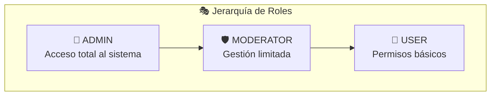
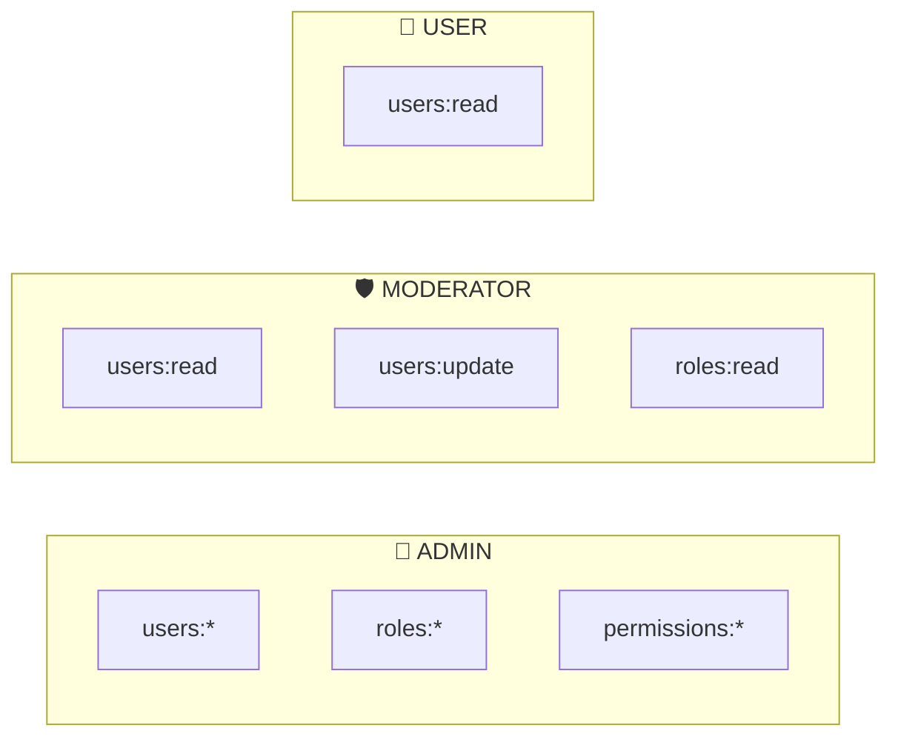
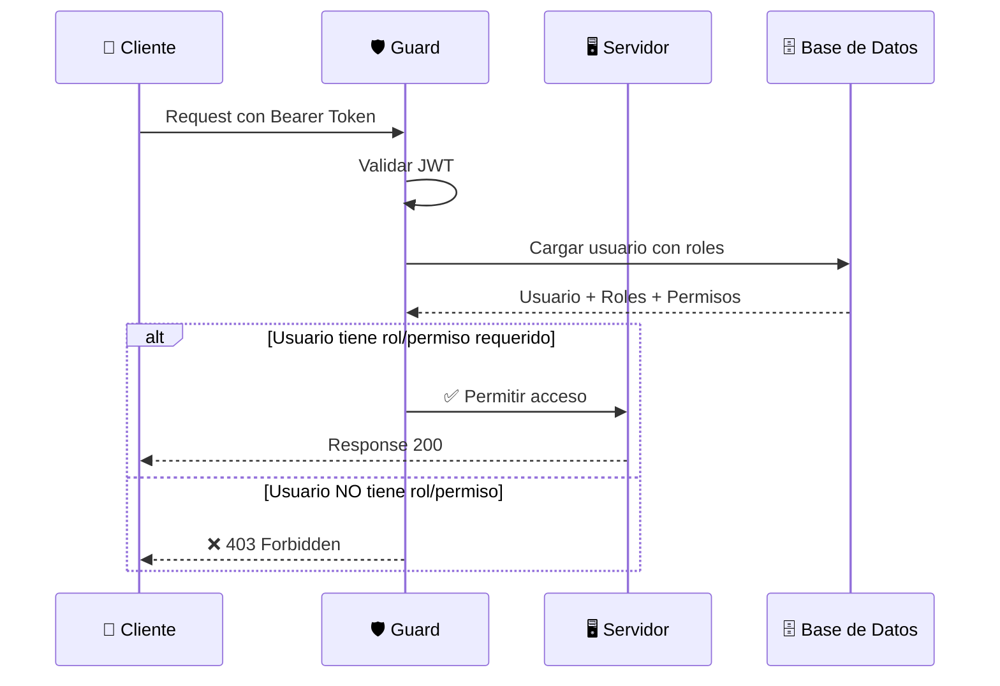
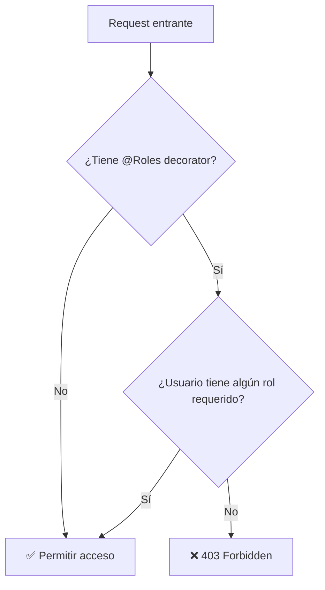
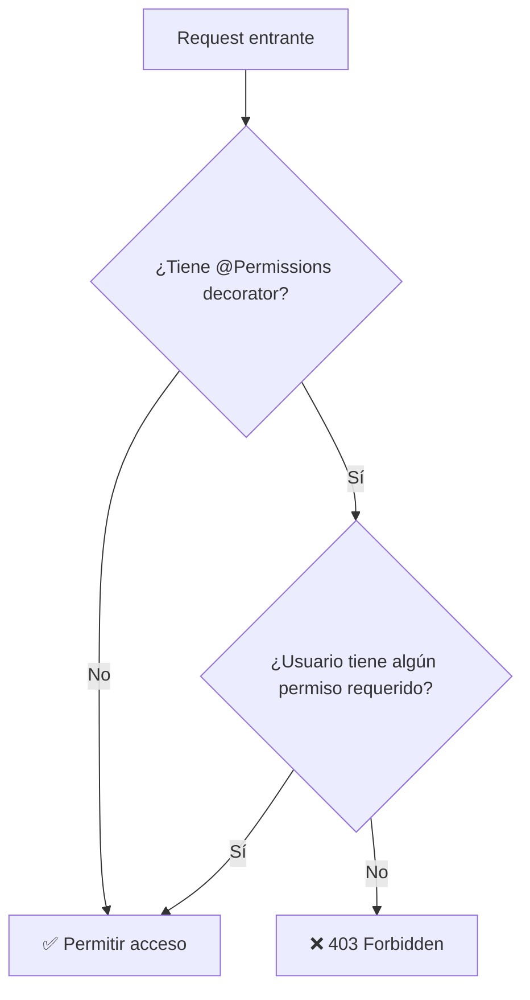
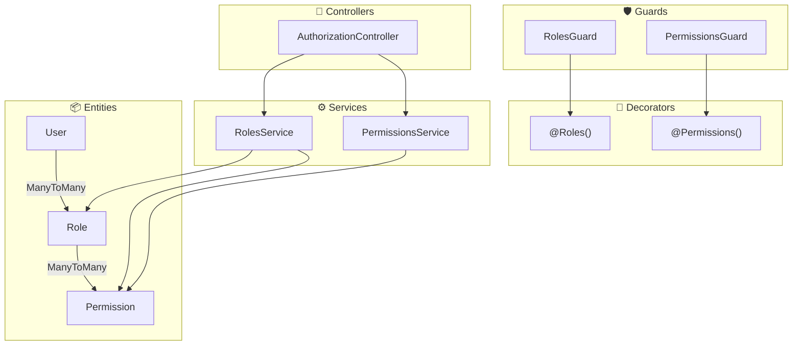

# 🛡️ Módulo de Autorización - Documentación de Endpoints

Esta documentación describe todos los endpoints disponibles en el módulo de autorización (roles y permisos). El sistema implementa un modelo RBAC (Role-Based Access Control) que permite controlar el acceso a recursos basándose en roles y permisos.

---

## 📋 Tabla de Contenidos

- [🛡️ Módulo de Autorización - Documentación de Endpoints](#️-módulo-de-autorización---documentación-de-endpoints)
  - [📋 Tabla de Contenidos](#-tabla-de-contenidos)
  - [🌐 Resumen General](#-resumen-general)
  - [🎭 Sistema de Roles](#-sistema-de-roles)
    - [Roles Predefinidos](#roles-predefinidos)
    - [Jerarquía de Permisos](#jerarquía-de-permisos)
  - [🔑 Sistema de Permisos](#-sistema-de-permisos)
    - [Permisos Predefinidos](#permisos-predefinidos)
    - [Convención de Nombres](#convención-de-nombres)
  - [📡 Endpoints de Roles](#-endpoints-de-roles)
    - [1. 📋 Listar Todos los Roles](#1--listar-todos-los-roles)
    - [2. 🔍 Obtener Rol por ID](#2--obtener-rol-por-id)
    - [3. ➕ Crear Nuevo Rol](#3--crear-nuevo-rol)
    - [4. 🔗 Asignar Permisos a Rol](#4--asignar-permisos-a-rol)
    - [5. ❌ Remover Permiso de Rol](#5--remover-permiso-de-rol)
    - [6. 🗑️ Eliminar Rol](#6-️-eliminar-rol)
  - [📡 Endpoints de Permisos](#-endpoints-de-permisos)
    - [7. 📋 Listar Todos los Permisos](#7--listar-todos-los-permisos)
    - [8. 📂 Obtener Permisos por Módulo](#8--obtener-permisos-por-módulo)
    - [9. 🔍 Obtener Permiso por ID](#9--obtener-permiso-por-id)
    - [10. ➕ Crear Nuevo Permiso](#10--crear-nuevo-permiso)
    - [11. 🗑️ Eliminar Permiso](#11-️-eliminar-permiso)
  - [🔄 Flujo de Autorización](#-flujo-de-autorización)
    - [Verificación de Roles](#verificación-de-roles)
    - [Verificación de Permisos](#verificación-de-permisos)
  - [❌ Códigos de Error](#-códigos-de-error)
    - [Estructura de Error](#estructura-de-error)
    - [Tabla de Códigos HTTP](#tabla-de-códigos-http)
  - [💻 Ejemplos de Uso](#-ejemplos-de-uso)
    - [Usando cURL](#usando-curl)
    - [Usando JavaScript/TypeScript](#usando-javascripttypescript)
  - [🏗️ Arquitectura del Módulo](#️-arquitectura-del-módulo)

---

## 🌐 Resumen General

| Endpoint | Método | Auth | Rol Requerido | Descripción |
|----------|--------|------|---------------|-------------|
| `/authorization/roles` | GET | ✅ | ADMIN | Listar roles |
| `/authorization/roles/:id` | GET | ✅ | ADMIN | Obtener rol |
| `/authorization/roles` | POST | ✅ | ADMIN | Crear rol |
| `/authorization/roles/:id/permissions` | POST | ✅ | ADMIN | Asignar permisos |
| `/authorization/roles/:roleId/permissions/:permissionName` | DELETE | ✅ | ADMIN | Remover permiso |
| `/authorization/roles/:id` | DELETE | ✅ | ADMIN | Eliminar rol |
| `/authorization/permissions` | GET | ✅ | ADMIN | Listar permisos |
| `/authorization/permissions/module/:module` | GET | ✅ | ADMIN | Permisos por módulo |
| `/authorization/permissions/:id` | GET | ✅ | ADMIN | Obtener permiso |
| `/authorization/permissions` | POST | ✅ | ADMIN | Crear permiso |
| `/authorization/permissions/:id` | DELETE | ✅ | ADMIN | Eliminar permiso |

> ⚠️ **Importante:** Todos los endpoints de autorización requieren autenticación y rol `ADMIN`.

---

## 🎭 Sistema de Roles

### Roles Predefinidos

El sistema incluye tres roles predefinidos que se crean automáticamente al iniciar la aplicación:



| Rol | Descripción | Permisos Asignados |
|-----|-------------|-------------------|
| 👑 **ADMIN** | Administrador con acceso total | Todos los permisos |
| 🛡️ **MODERATOR** | Moderador con permisos de gestión | Lectura y actualización |
| 👤 **USER** | Usuario estándar | Solo lectura básica |

### Jerarquía de Permisos



---

## 🔑 Sistema de Permisos

### Permisos Predefinidos

Los siguientes permisos se crean automáticamente durante la inicialización:

| Permiso | Descripción | Módulo |
|---------|-------------|--------|
| `users:read` | Ver usuarios | users |
| `users:create` | Crear usuarios | users |
| `users:update` | Actualizar usuarios | users |
| `users:delete` | Eliminar usuarios | users |
| `roles:read` | Ver roles | roles |
| `roles:create` | Crear roles | roles |
| `roles:update` | Actualizar roles | roles |
| `roles:delete` | Eliminar roles | roles |
| `roles:assign` | Asignar roles a usuarios | roles |
| `permissions:read` | Ver permisos | permissions |
| `permissions:create` | Crear permisos | permissions |
| `permissions:delete` | Eliminar permisos | permissions |

### Convención de Nombres

Los permisos siguen la convención `módulo:acción`:

```
users:read      →  Módulo: users,      Acción: read
roles:assign    →  Módulo: roles,      Acción: assign
permissions:*   →  Módulo: permissions, Acción: todas
```

---

## 📡 Endpoints de Roles

Todos los endpoints requieren:
- ✅ Autenticación (Bearer Token)
- 👑 Rol ADMIN

---

### 1. 📋 Listar Todos los Roles

Obtiene la lista completa de roles con sus permisos asociados.

**Endpoint:** `GET /authorization/roles`

**Headers:**
```
Authorization: Bearer <access_token>
```

**Response Exitoso (200):**
```json
[
  {
    "id": "uuid-rol-admin",
    "name": "ADMIN",
    "description": "Administrador con acceso total al sistema",
    "createdAt": "2026-03-09T10:00:00.000Z",
    "updatedAt": "2026-03-09T10:00:00.000Z",
    "permissions": [
      {
        "id": "uuid-permiso",
        "name": "users:read",
        "description": "Ver usuarios",
        "module": "users"
      }
      // ... más permisos
    ]
  },
  {
    "id": "uuid-rol-moderator",
    "name": "MODERATOR",
    "description": "Moderador con permisos de gestión limitados",
    "permissions": [...]
  },
  {
    "id": "uuid-rol-user",
    "name": "USER",
    "description": "Usuario estándar con permisos básicos",
    "permissions": [...]
  }
]
```

---

### 2. 🔍 Obtener Rol por ID

Obtiene los detalles de un rol específico.

**Endpoint:** `GET /authorization/roles/:id`

**Parámetros URL:**
| Parámetro | Tipo | Descripción |
|-----------|------|-------------|
| `id` | UUID | ID del rol |

**Response Exitoso (200):**
```json
{
  "id": "uuid-rol",
  "name": "ADMIN",
  "description": "Administrador con acceso total al sistema",
  "createdAt": "2026-03-09T10:00:00.000Z",
  "updatedAt": "2026-03-09T10:00:00.000Z",
  "permissions": [
    {
      "id": "uuid-permiso",
      "name": "users:read",
      "description": "Ver usuarios",
      "module": "users"
    }
  ]
}
```

**Errores Posibles:**

| Código | Descripción |
|--------|-------------|
| 404 | Rol no encontrado |

---

### 3. ➕ Crear Nuevo Rol

Crea un nuevo rol en el sistema.

**Endpoint:** `POST /authorization/roles`

**Request Body:**
```json
{
  "name": "ADMIN",
  "description": "Descripción opcional del rol"
}
```

**Valores válidos para `name`:**
- `ADMIN`
- `MODERATOR`
- `USER`

**Response Exitoso (201):**
```json
{
  "id": "uuid-nuevo-rol",
  "name": "ADMIN",
  "description": "Descripción opcional del rol",
  "createdAt": "2026-03-09T10:00:00.000Z",
  "updatedAt": "2026-03-09T10:00:00.000Z",
  "permissions": []
}
```

**Errores Posibles:**

| Código | Descripción |
|--------|-------------|
| 400 | Tipo de rol inválido |
| 409 | El rol ya existe |

---

### 4. 🔗 Asignar Permisos a Rol

Asigna una lista de permisos a un rol específico.

**Endpoint:** `POST /authorization/roles/:id/permissions`

**Parámetros URL:**
| Parámetro | Tipo | Descripción |
|-----------|------|-------------|
| `id` | UUID | ID del rol |

**Request Body:**
```json
{
  "permissions": ["users:read", "users:update", "roles:read"]
}
```

**Response Exitoso (200):**
```json
{
  "id": "uuid-rol",
  "name": "MODERATOR",
  "description": "Moderador con permisos de gestión limitados",
  "permissions": [
    {
      "id": "uuid-1",
      "name": "users:read",
      "description": "Ver usuarios",
      "module": "users"
    },
    {
      "id": "uuid-2",
      "name": "users:update",
      "description": "Actualizar usuarios",
      "module": "users"
    },
    {
      "id": "uuid-3",
      "name": "roles:read",
      "description": "Ver roles",
      "module": "roles"
    }
  ]
}
```

> ⚠️ **Nota:** Esta operación **reemplaza** todos los permisos actuales del rol con los nuevos permisos especificados.

**Errores Posibles:**

| Código | Descripción |
|--------|-------------|
| 404 | Rol no encontrado |
| 404 | Uno o más permisos no existen |

---

### 5. ❌ Remover Permiso de Rol

Elimina un permiso específico de un rol.

**Endpoint:** `DELETE /authorization/roles/:roleId/permissions/:permissionName`

**Parámetros URL:**
| Parámetro | Tipo | Descripción |
|-----------|------|-------------|
| `roleId` | UUID | ID del rol |
| `permissionName` | string | Nombre del permiso (ej: `users:read`) |

**Response Exitoso (200):**
```json
{
  "id": "uuid-rol",
  "name": "MODERATOR",
  "permissions": [
    // Lista actualizada sin el permiso removido
  ]
}
```

---

### 6. 🗑️ Eliminar Rol

Elimina un rol del sistema.

**Endpoint:** `DELETE /authorization/roles/:id`

**Parámetros URL:**
| Parámetro | Tipo | Descripción |
|-----------|------|-------------|
| `id` | UUID | ID del rol |

**Response Exitoso (204):** Sin contenido

**Errores Posibles:**

| Código | Descripción |
|--------|-------------|
| 404 | Rol no encontrado |

> ⚠️ **Advertencia:** Eliminar un rol puede afectar a los usuarios que lo tengan asignado.

---

## 📡 Endpoints de Permisos

---

### 7. 📋 Listar Todos los Permisos

Obtiene la lista completa de permisos disponibles.

**Endpoint:** `GET /authorization/permissions`

**Response Exitoso (200):**
```json
[
  {
    "id": "uuid-permiso",
    "name": "users:read",
    "description": "Ver usuarios",
    "module": "users",
    "createdAt": "2026-03-09T10:00:00.000Z",
    "updatedAt": "2026-03-09T10:00:00.000Z",
    "roles": [
      {
        "id": "uuid-rol",
        "name": "ADMIN"
      }
    ]
  }
  // ... más permisos
]
```

---

### 8. 📂 Obtener Permisos por Módulo

Filtra los permisos por módulo.

**Endpoint:** `GET /authorization/permissions/module/:module`

**Parámetros URL:**
| Parámetro | Tipo | Descripción |
|-----------|------|-------------|
| `module` | string | Nombre del módulo (ej: `users`, `roles`) |

**Response Exitoso (200):**
```json
[
  {
    "id": "uuid-1",
    "name": "users:read",
    "description": "Ver usuarios",
    "module": "users"
  },
  {
    "id": "uuid-2",
    "name": "users:create",
    "description": "Crear usuarios",
    "module": "users"
  },
  {
    "id": "uuid-3",
    "name": "users:update",
    "description": "Actualizar usuarios",
    "module": "users"
  },
  {
    "id": "uuid-4",
    "name": "users:delete",
    "description": "Eliminar usuarios",
    "module": "users"
  }
]
```

---

### 9. 🔍 Obtener Permiso por ID

Obtiene los detalles de un permiso específico.

**Endpoint:** `GET /authorization/permissions/:id`

**Parámetros URL:**
| Parámetro | Tipo | Descripción |
|-----------|------|-------------|
| `id` | UUID | ID del permiso |

**Response Exitoso (200):**
```json
{
  "id": "uuid-permiso",
  "name": "users:read",
  "description": "Ver usuarios",
  "module": "users",
  "createdAt": "2026-03-09T10:00:00.000Z",
  "updatedAt": "2026-03-09T10:00:00.000Z",
  "roles": [
    {
      "id": "uuid-rol-1",
      "name": "ADMIN"
    },
    {
      "id": "uuid-rol-2",
      "name": "MODERATOR"
    }
  ]
}
```

---

### 10. ➕ Crear Nuevo Permiso

Crea un nuevo permiso en el sistema.

**Endpoint:** `POST /authorization/permissions`

**Request Body:**
```json
{
  "name": "products:read",
  "description": "Ver información de productos",
  "module": "products"
}
```

**Validaciones:**
- `name`: 3-100 caracteres
- `description`: máximo 255 caracteres
- `module`: 2-50 caracteres

**Response Exitoso (201):**
```json
{
  "id": "uuid-nuevo-permiso",
  "name": "products:read",
  "description": "Ver información de productos",
  "module": "products",
  "createdAt": "2026-03-09T10:00:00.000Z",
  "updatedAt": "2026-03-09T10:00:00.000Z"
}
```

**Errores Posibles:**

| Código | Descripción |
|--------|-------------|
| 400 | Validación fallida |
| 409 | El permiso ya existe |

---

### 11. 🗑️ Eliminar Permiso

Elimina un permiso del sistema.

**Endpoint:** `DELETE /authorization/permissions/:id`

**Parámetros URL:**
| Parámetro | Tipo | Descripción |
|-----------|------|-------------|
| `id` | UUID | ID del permiso |

**Response Exitoso (204):** Sin contenido

> ⚠️ **Advertencia:** Eliminar un permiso lo removerá automáticamente de todos los roles que lo tengan asignado.

---

## 🔄 Flujo de Autorización



### Verificación de Roles



### Verificación de Permisos



---

## ❌ Códigos de Error

### Estructura de Error

```json
{
  "statusCode": 403,
  "message": "Acceso denegado. Se requiere uno de los siguientes roles: ADMIN",
  "error": "Forbidden"
}
```

### Tabla de Códigos HTTP

| Código | Significado | Cuándo ocurre |
|--------|-------------|---------------|
| 200 | ✅ OK | Operación exitosa |
| 201 | ✅ Created | Recurso creado |
| 204 | ✅ No Content | Eliminación exitosa |
| 400 | ❌ Bad Request | Datos inválidos |
| 401 | ❌ Unauthorized | Token no válido |
| 403 | ❌ Forbidden | Sin permisos suficientes |
| 404 | ❌ Not Found | Recurso no encontrado |
| 409 | ❌ Conflict | Recurso ya existe |

---

## 💻 Ejemplos de Uso

### Usando cURL

**Listar roles:**
```bash
curl -X GET http://localhost:3000/authorization/roles \
  -H "Authorization: Bearer <admin_token>"
```

**Crear permiso:**
```bash
curl -X POST http://localhost:3000/authorization/permissions \
  -H "Authorization: Bearer <admin_token>" \
  -H "Content-Type: application/json" \
  -d '{
    "name": "products:read",
    "description": "Ver productos",
    "module": "products"
  }'
```

**Asignar permisos a rol:**
```bash
curl -X POST http://localhost:3000/authorization/roles/<role_id>/permissions \
  -H "Authorization: Bearer <admin_token>" \
  -H "Content-Type: application/json" \
  -d '{
    "permissions": ["users:read", "users:update"]
  }'
```

### Usando JavaScript/TypeScript

```typescript
class AuthorizationService {
  private baseUrl = 'http://localhost:3000/authorization';
  
  constructor(private accessToken: string) {}
  
  private get headers() {
    return {
      'Authorization': `Bearer ${this.accessToken}`,
      'Content-Type': 'application/json'
    };
  }
  
  async getRoles() {
    const response = await fetch(`${this.baseUrl}/roles`, {
      headers: this.headers
    });
    return response.json();
  }
  
  async getPermissions() {
    const response = await fetch(`${this.baseUrl}/permissions`, {
      headers: this.headers
    });
    return response.json();
  }
  
  async assignPermissionsToRole(roleId: string, permissions: string[]) {
    const response = await fetch(`${this.baseUrl}/roles/${roleId}/permissions`, {
      method: 'POST',
      headers: this.headers,
      body: JSON.stringify({ permissions })
    });
    return response.json();
  }
  
  async createPermission(name: string, description: string, module: string) {
    const response = await fetch(`${this.baseUrl}/permissions`, {
      method: 'POST',
      headers: this.headers,
      body: JSON.stringify({ name, description, module })
    });
    return response.json();
  }
}
```

---

## 🏗️ Arquitectura del Módulo



---

> 📝 **Última actualización:** Marzo 2026
> 
> 📖 **Documentación Swagger:** [http://localhost:3000/api/docs](http://localhost:3000/api/docs)
