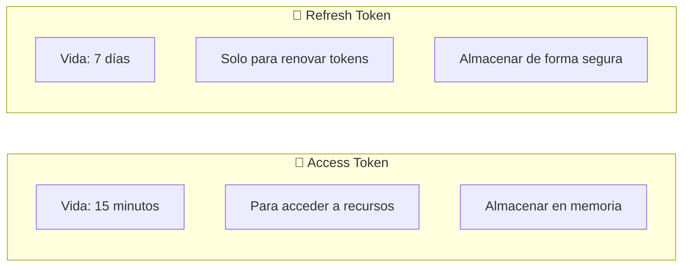
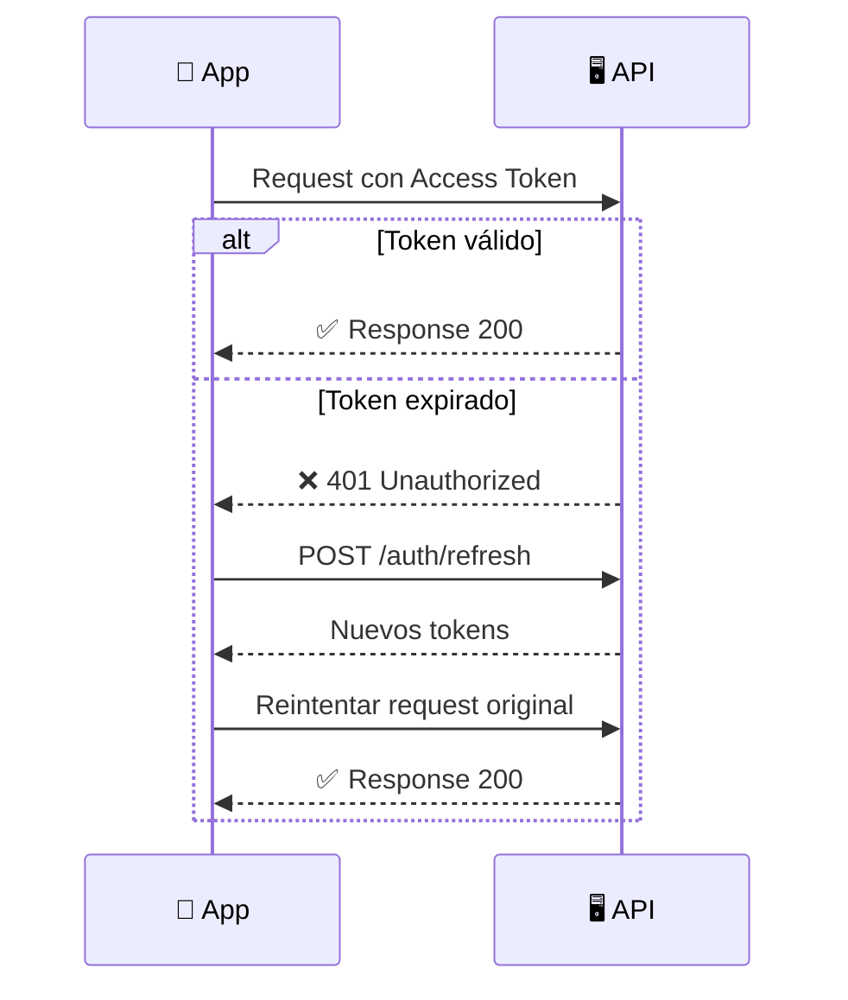
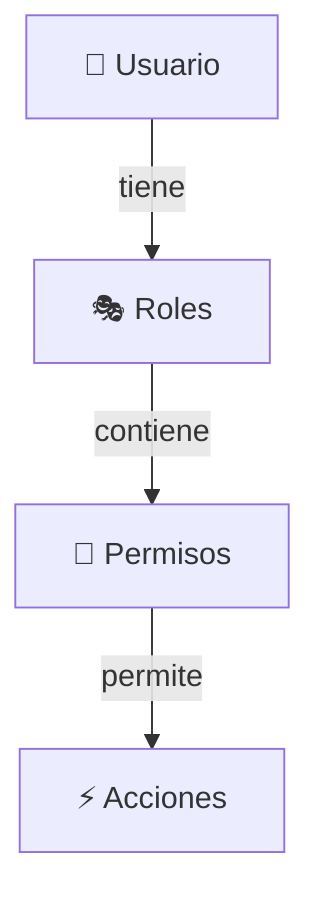
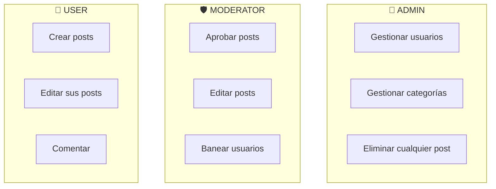

# 📖 Manual de Usuario - Sistema de Autenticación y Autorización

Este manual está diseñado para desarrolladores que necesitan integrar y utilizar el sistema de autenticación y autorización en sus aplicaciones frontend o servicios.

---

## 📋 Tabla de Contenidos

- [📖 Manual de Usuario - Sistema de Autenticación y Autorización](#-manual-de-usuario---sistema-de-autenticación-y-autorización)
  - [📋 Tabla de Contenidos](#-tabla-de-contenidos)
  - [🚀 Inicio Rápido](#-inicio-rápido)
    - [Prerrequisitos](#prerrequisitos)
    - [Instalación y Configuración](#instalación-y-configuración)
    - [Tu Primera Petición](#tu-primera-petición)
  - [🔐 Autenticación](#-autenticación)
    - [Conceptos Básicos](#conceptos-básicos)
    - [Registro de Usuario](#registro-de-usuario)
    - [Inicio de Sesión](#inicio-de-sesión)
    - [Gestión de Tokens](#gestión-de-tokens)
    - [Verificación de Email](#verificación-de-email)
    - [Recuperación de Contraseña](#recuperación-de-contraseña)
    - [Cierre de Sesión](#cierre-de-sesión)
  - [🛡️ Autorización](#️-autorización)
    - [Entendiendo Roles y Permisos](#entendiendo-roles-y-permisos)
    - [Roles del Sistema](#roles-del-sistema)
    - [Permisos del Sistema](#permisos-del-sistema)
    - [Protegiendo tus Endpoints](#protegiendo-tus-endpoints)
  - [💻 Integración Frontend](#-integración-frontend)
    - [Servicio de Autenticación Completo](#servicio-de-autenticación-completo)
    - [Interceptor de Axios](#interceptor-de-axios)
    - [Guards de Rutas (Vue Router)](#guards-de-rutas-vue-router)
    - [Composable de Autenticación (Vue 3)](#composable-de-autenticación-vue-3)
  - [🔧 Integración Backend](#-integración-backend)
    - [Proteger Endpoints con Roles](#proteger-endpoints-con-roles)
    - [Proteger Endpoints con Permisos](#proteger-endpoints-con-permisos)
    - [Acceder al Usuario Autenticado](#acceder-al-usuario-autenticado)
    - [Crear un Nuevo Módulo Protegido](#crear-un-nuevo-módulo-protegido)
  - [📊 Casos de Uso Comunes](#-casos-de-uso-comunes)
    - [1. Sistema de Blog con Moderación](#1-sistema-de-blog-con-moderación)
    - [2. E-commerce con Panel Admin](#2-e-commerce-con-panel-admin)
    - [3. Multi-tenancy](#3-multi-tenancy)
  - [🔍 Troubleshooting](#-troubleshooting)
    - [Problemas Comunes](#problemas-comunes)
    - [Debugging](#debugging)
  - [📚 Referencia Rápida](#-referencia-rápida)
    - [Endpoints de Autenticación](#endpoints-de-autenticación)
    - [Endpoints de Autorización](#endpoints-de-autorización)
  - [✅ Checklist de Seguridad](#-checklist-de-seguridad)

---

## 🚀 Inicio Rápido

### Prerrequisitos

- Node.js 18+
- PostgreSQL 14+
- npm o yarn

### Instalación y Configuración

1. **Clonar y configurar el proyecto:**

```bash
git clone <repositorio>
cd backend
npm install
```

2. **Configurar variables de entorno:**

Crea un archivo `.env` basándote en `.env.example`:

```env
# Base de datos
DB_HOST=localhost
DB_PORT=5432
DB_USERNAME=postgres
DB_PASSWORD=tu_password
DB_NAME=fullstack_best_practice

# JWT
JWT_SECRET=tu_secreto_super_seguro_y_largo
JWT_REFRESH_SECRET=otro_secreto_diferente

# Email (Gmail)
EMAIL_HOST=smtp.gmail.com
EMAIL_PORT=587
EMAIL_SECURE=false
EMAIL_USER=tu_email@gmail.com
EMAIL_PASSWORD=tu_app_password

# Aplicación
NODE_ENV=development
PORT=3000
FRONTEND_URL=http://localhost:5173
```

3. **Iniciar la aplicación:**

```bash
npm run start:dev
```

4. **Verificar que funciona:**

Visita `http://localhost:3000/api/docs` para ver la documentación Swagger.

### Tu Primera Petición

```bash
# Registrar un usuario
curl -X POST http://localhost:3000/auth/register \
  -H "Content-Type: application/json" \
  -d '{
    "email": "test@ejemplo.com",
    "password": "MiPassword123!",
    "firstName": "Test",
    "lastName": "User"
  }'
```

---

## 🔐 Autenticación

### Conceptos Básicos

El sistema utiliza **JWT (JSON Web Tokens)** con una estrategia de **doble token**:



| Token | Duración | Uso | Almacenamiento Recomendado |
|-------|----------|-----|---------------------------|
| Access Token | 15 min | Autenticar peticiones | Memoria (variable/state) |
| Refresh Token | 7 días | Obtener nuevos tokens | HttpOnly Cookie o localStorage |

### Registro de Usuario

```typescript
// Ejemplo de registro
const response = await fetch('/auth/register', {
  method: 'POST',
  headers: { 'Content-Type': 'application/json' },
  body: JSON.stringify({
    email: 'usuario@ejemplo.com',
    password: 'MiPassword123!',  // Ver requisitos abajo
    firstName: 'Juan',
    lastName: 'Pérez'
  })
});

const { user, tokens } = await response.json();
```

**Requisitos de contraseña:**
- ✅ Mínimo 8 caracteres
- ✅ Al menos una mayúscula (A-Z)
- ✅ Al menos una minúscula (a-z)
- ✅ Al menos un número (0-9)
- ✅ Al menos un carácter especial (@$!%*?&)

**Qué sucede al registrarse:**
1. Se crea el usuario con el rol `USER` por defecto
2. Se envía un email de verificación
3. Se generan los tokens de acceso
4. El usuario puede usar la app inmediatamente

### Inicio de Sesión

```typescript
const response = await fetch('/auth/login', {
  method: 'POST',
  headers: { 'Content-Type': 'application/json' },
  body: JSON.stringify({
    email: 'usuario@ejemplo.com',
    password: 'MiPassword123!'
  })
});

if (response.ok) {
  const { user, tokens } = await response.json();
  
  // Guardar tokens
  localStorage.setItem('refreshToken', tokens.refreshToken);
  // El accessToken se guarda en memoria (ver ejemplo completo más abajo)
  
  console.log('Usuario:', user);
  console.log('Roles:', user.roles);
}
```

### Gestión de Tokens

#### Renovar tokens antes de que expiren

```typescript
async function refreshTokens() {
  const refreshToken = localStorage.getItem('refreshToken');
  
  const response = await fetch('/auth/refresh', {
    method: 'POST',
    headers: { 'Content-Type': 'application/json' },
    body: JSON.stringify({ refreshToken })
  });
  
  if (response.ok) {
    const { tokens } = await response.json();
    // Importante: actualizar AMBOS tokens
    localStorage.setItem('refreshToken', tokens.refreshToken);
    return tokens.accessToken;
  } else {
    // Token inválido, redirigir a login
    window.location.href = '/login';
  }
}
```

#### Estrategia de renovación automática



### Verificación de Email

Cuando un usuario se registra, recibe un email con un enlace de verificación:

```
https://tu-app.com/verify-email?token=abc123...
```

**En el frontend:**

```typescript
// Extraer token de la URL
const urlParams = new URLSearchParams(window.location.search);
const token = urlParams.get('token');

// Verificar email
const response = await fetch('/auth/verify-email', {
  method: 'POST',
  headers: { 'Content-Type': 'application/json' },
  body: JSON.stringify({ token })
});

if (response.ok) {
  alert('¡Email verificado exitosamente!');
}
```

**Reenviar verificación:**

```typescript
await fetch('/auth/resend-verification', {
  method: 'POST',
  headers: { 'Content-Type': 'application/json' },
  body: JSON.stringify({ email: 'usuario@ejemplo.com' })
});
```

### Recuperación de Contraseña

**Paso 1: Solicitar recuperación**

```typescript
await fetch('/auth/forgot-password', {
  method: 'POST',
  headers: { 'Content-Type': 'application/json' },
  body: JSON.stringify({ email: 'usuario@ejemplo.com' })
});
// Siempre responde con éxito (por seguridad)
```

**Paso 2: Restablecer con el token del email**

```typescript
const response = await fetch('/auth/reset-password', {
  method: 'POST',
  headers: { 'Content-Type': 'application/json' },
  body: JSON.stringify({
    token: 'token-del-email',
    newPassword: 'NuevaPassword123!'
  })
});
```

### Cierre de Sesión

**Cerrar sesión actual:**

```typescript
await fetch('/auth/logout', {
  method: 'POST',
  headers: {
    'Authorization': `Bearer ${accessToken}`,
    'Content-Type': 'application/json'
  },
  body: JSON.stringify({
    refreshToken: localStorage.getItem('refreshToken')
  })
});

// Limpiar almacenamiento local
localStorage.removeItem('refreshToken');
```

**Cerrar TODAS las sesiones (todos los dispositivos):**

```typescript
await fetch('/auth/logout-all', {
  method: 'POST',
  headers: { 'Authorization': `Bearer ${accessToken}` }
});
```

---

## 🛡️ Autorización

### Entendiendo Roles y Permisos

El sistema implementa **RBAC (Role-Based Access Control)**:



- **Usuario** → puede tener múltiples **Roles**
- **Rol** → agrupa múltiples **Permisos**
- **Permiso** → define una acción específica

### Roles del Sistema

| Rol | Descripción | Caso de uso |
|-----|-------------|-------------|
| 👑 **ADMIN** | Control total | Super administrador |
| 🛡️ **MODERATOR** | Gestión limitada | Moderadores de contenido |
| 👤 **USER** | Acceso básico | Usuarios regulares |

**Asignación por defecto:** Todos los usuarios nuevos reciben el rol `USER`.

### Permisos del Sistema

Los permisos siguen el formato `módulo:acción`:

| Módulo | Permisos | Descripción |
|--------|----------|-------------|
| `users` | `read`, `create`, `update`, `delete` | Gestión de usuarios |
| `roles` | `read`, `create`, `update`, `delete`, `assign` | Gestión de roles |
| `permissions` | `read`, `create`, `delete` | Gestión de permisos |

**Distribución por rol:**

```
ADMIN:      Todos los permisos
MODERATOR:  *:read, *:update
USER:       users:read
```

### Protegiendo tus Endpoints

En el frontend, verifica roles/permisos antes de mostrar elementos:

```typescript
// Verificar si el usuario tiene un rol
function hasRole(user, roleName) {
  return user.roles?.some(role => role.name === roleName) ?? false;
}

// Verificar si el usuario tiene un permiso
function hasPermission(user, permissionName) {
  return user.roles?.some(role => 
    role.permissions?.some(p => p.name === permissionName)
  ) ?? false;
}

// Uso en componente Vue
<template>
  <button v-if="hasRole(user, 'ADMIN')">
    Panel de Administración
  </button>
  
  <button v-if="hasPermission(user, 'users:delete')">
    Eliminar Usuario
  </button>
</template>
```

---

## 💻 Integración Frontend

### Servicio de Autenticación Completo

```typescript
// services/auth.service.ts
interface User {
  id: string;
  email: string;
  firstName: string;
  lastName: string;
  roles: Role[];
}

interface Role {
  id: string;
  name: 'ADMIN' | 'MODERATOR' | 'USER';
  permissions: Permission[];
}

interface Permission {
  id: string;
  name: string;
  module: string;
}

interface Tokens {
  accessToken: string;
  refreshToken: string;
}

class AuthService {
  private baseUrl = 'http://localhost:3000';
  private accessToken: string | null = null;
  
  // ==================== AUTENTICACIÓN ====================

  async register(data: {
    email: string;
    password: string;
    firstName: string;
    lastName: string;
  }): Promise<{ user: User; tokens: Tokens }> {
    const response = await fetch(`${this.baseUrl}/auth/register`, {
      method: 'POST',
      headers: { 'Content-Type': 'application/json' },
      body: JSON.stringify(data)
    });
    
    if (!response.ok) {
      const error = await response.json();
      throw new Error(error.message);
    }
    
    const result = await response.json();
    this.setTokens(result.tokens);
    return result;
  }

  async login(email: string, password: string): Promise<{ user: User; tokens: Tokens }> {
    const response = await fetch(`${this.baseUrl}/auth/login`, {
      method: 'POST',
      headers: { 'Content-Type': 'application/json' },
      body: JSON.stringify({ email, password })
    });
    
    if (!response.ok) {
      throw new Error('Credenciales inválidas');
    }
    
    const result = await response.json();
    this.setTokens(result.tokens);
    return result;
  }

  async logout(): Promise<void> {
    const refreshToken = localStorage.getItem('refreshToken');
    
    if (this.accessToken && refreshToken) {
      await fetch(`${this.baseUrl}/auth/logout`, {
        method: 'POST',
        headers: {
          'Authorization': `Bearer ${this.accessToken}`,
          'Content-Type': 'application/json'
        },
        body: JSON.stringify({ refreshToken })
      });
    }
    
    this.clearTokens();
  }

  async logoutAll(): Promise<void> {
    if (!this.accessToken) return;
    
    await fetch(`${this.baseUrl}/auth/logout-all`, {
      method: 'POST',
      headers: { 'Authorization': `Bearer ${this.accessToken}` }
    });
    
    this.clearTokens();
  }

  // ==================== TOKENS ====================

  private setTokens(tokens: Tokens): void {
    this.accessToken = tokens.accessToken;
    localStorage.setItem('refreshToken', tokens.refreshToken);
  }

  private clearTokens(): void {
    this.accessToken = null;
    localStorage.removeItem('refreshToken');
  }

  async refreshTokens(): Promise<string | null> {
    const refreshToken = localStorage.getItem('refreshToken');
    
    if (!refreshToken) return null;
    
    const response = await fetch(`${this.baseUrl}/auth/refresh`, {
      method: 'POST',
      headers: { 'Content-Type': 'application/json' },
      body: JSON.stringify({ refreshToken })
    });
    
    if (!response.ok) {
      this.clearTokens();
      return null;
    }
    
    const { tokens } = await response.json();
    this.setTokens(tokens);
    return tokens.accessToken;
  }

  getAccessToken(): string | null {
    return this.accessToken;
  }

  // ==================== PERFIL ====================

  async getProfile(): Promise<User> {
    const response = await this.authenticatedFetch('/auth/me');
    return response.json();
  }

  async changePassword(currentPassword: string, newPassword: string): Promise<void> {
    await this.authenticatedFetch('/auth/change-password', {
      method: 'POST',
      body: JSON.stringify({ currentPassword, newPassword })
    });
  }

  // ==================== EMAIL ====================

  async verifyEmail(token: string): Promise<void> {
    const response = await fetch(`${this.baseUrl}/auth/verify-email`, {
      method: 'POST',
      headers: { 'Content-Type': 'application/json' },
      body: JSON.stringify({ token })
    });
    
    if (!response.ok) {
      throw new Error('Token de verificación inválido');
    }
  }

  async requestPasswordReset(email: string): Promise<void> {
    await fetch(`${this.baseUrl}/auth/forgot-password`, {
      method: 'POST',
      headers: { 'Content-Type': 'application/json' },
      body: JSON.stringify({ email })
    });
  }

  async resetPassword(token: string, newPassword: string): Promise<void> {
    const response = await fetch(`${this.baseUrl}/auth/reset-password`, {
      method: 'POST',
      headers: { 'Content-Type': 'application/json' },
      body: JSON.stringify({ token, newPassword })
    });
    
    if (!response.ok) {
      throw new Error('Token inválido o expirado');
    }
  }

  // ==================== HELPERS ====================

  private async authenticatedFetch(
    endpoint: string,
    options: RequestInit = {}
  ): Promise<Response> {
    let token = this.accessToken;
    
    // Si no hay token, intentar refrescar
    if (!token) {
      token = await this.refreshTokens();
      if (!token) {
        throw new Error('No autenticado');
      }
    }
    
    const response = await fetch(`${this.baseUrl}${endpoint}`, {
      ...options,
      headers: {
        'Authorization': `Bearer ${token}`,
        'Content-Type': 'application/json',
        ...options.headers
      }
    });
    
    // Si el token expiró, intentar refrescar y reintentar
    if (response.status === 401) {
      token = await this.refreshTokens();
      if (!token) {
        throw new Error('Sesión expirada');
      }
      
      return fetch(`${this.baseUrl}${endpoint}`, {
        ...options,
        headers: {
          'Authorization': `Bearer ${token}`,
          'Content-Type': 'application/json',
          ...options.headers
        }
      });
    }
    
    return response;
  }

  // ==================== AUTORIZACIÓN ====================

  hasRole(user: User, roleName: string): boolean {
    return user.roles?.some(role => role.name === roleName) ?? false;
  }

  hasAnyRole(user: User, roleNames: string[]): boolean {
    return roleNames.some(role => this.hasRole(user, role));
  }

  hasPermission(user: User, permissionName: string): boolean {
    return user.roles?.some(role =>
      role.permissions?.some(p => p.name === permissionName)
    ) ?? false;
  }

  hasAnyPermission(user: User, permissionNames: string[]): boolean {
    return permissionNames.some(p => this.hasPermission(user, p));
  }

  isAdmin(user: User): boolean {
    return this.hasRole(user, 'ADMIN');
  }

  isModerator(user: User): boolean {
    return this.hasAnyRole(user, ['ADMIN', 'MODERATOR']);
  }
}

export const authService = new AuthService();
```

### Interceptor de Axios

```typescript
// interceptors/auth.interceptor.ts
import axios from 'axios';
import { authService } from './auth.service';

const api = axios.create({
  baseURL: 'http://localhost:3000'
});

// Agregar token a todas las peticiones
api.interceptors.request.use((config) => {
  const token = authService.getAccessToken();
  if (token) {
    config.headers.Authorization = `Bearer ${token}`;
  }
  return config;
});

// Manejar errores de autenticación
api.interceptors.response.use(
  (response) => response,
  async (error) => {
    const originalRequest = error.config;
    
    if (error.response?.status === 401 && !originalRequest._retry) {
      originalRequest._retry = true;
      
      const newToken = await authService.refreshTokens();
      
      if (newToken) {
        originalRequest.headers.Authorization = `Bearer ${newToken}`;
        return api(originalRequest);
      }
    }
    
    return Promise.reject(error);
  }
);

export default api;
```

### Guards de Rutas (Vue Router)

```typescript
// router/guards.ts
import { authService } from '@/services/auth.service';
import type { NavigationGuardNext, RouteLocationNormalized } from 'vue-router';

// Guard de autenticación
export async function authGuard(
  to: RouteLocationNormalized,
  from: RouteLocationNormalized,
  next: NavigationGuardNext
) {
  const token = authService.getAccessToken() || await authService.refreshTokens();
  
  if (!token) {
    return next({ name: 'login', query: { redirect: to.fullPath } });
  }
  
  next();
}

// Guard de roles
export function roleGuard(allowedRoles: string[]) {
  return async (
    to: RouteLocationNormalized,
    from: RouteLocationNormalized,
    next: NavigationGuardNext
  ) => {
    try {
      const user = await authService.getProfile();
      
      if (authService.hasAnyRole(user, allowedRoles)) {
        next();
      } else {
        next({ name: 'forbidden' });
      }
    } catch {
      next({ name: 'login' });
    }
  };
}

// Guard de permisos
export function permissionGuard(requiredPermissions: string[]) {
  return async (
    to: RouteLocationNormalized,
    from: RouteLocationNormalized,
    next: NavigationGuardNext
  ) => {
    try {
      const user = await authService.getProfile();
      
      if (authService.hasAnyPermission(user, requiredPermissions)) {
        next();
      } else {
        next({ name: 'forbidden' });
      }
    } catch {
      next({ name: 'login' });
    }
  };
}
```

**Uso en router:**

```typescript
// router/index.ts
import { createRouter, createWebHistory } from 'vue-router';
import { authGuard, roleGuard, permissionGuard } from './guards';

const router = createRouter({
  history: createWebHistory(),
  routes: [
    {
      path: '/login',
      name: 'login',
      component: () => import('@/views/LoginView.vue')
    },
    {
      path: '/dashboard',
      name: 'dashboard',
      component: () => import('@/views/DashboardView.vue'),
      beforeEnter: authGuard  // Solo usuarios autenticados
    },
    {
      path: '/admin',
      name: 'admin',
      component: () => import('@/views/AdminView.vue'),
      beforeEnter: roleGuard(['ADMIN'])  // Solo admins
    },
    {
      path: '/users',
      name: 'users',
      component: () => import('@/views/UsersView.vue'),
      beforeEnter: permissionGuard(['users:read'])  // Requiere permiso
    },
    {
      path: '/forbidden',
      name: 'forbidden',
      component: () => import('@/views/ForbiddenView.vue')
    }
  ]
});

export default router;
```

### Composable de Autenticación (Vue 3)

```typescript
// composables/useAuth.ts
import { ref, computed, readonly } from 'vue';
import { authService } from '@/services/auth.service';
import type { User } from '@/types';

const user = ref<User | null>(null);
const loading = ref(true);
const error = ref<string | null>(null);

export function useAuth() {
  const isAuthenticated = computed(() => !!user.value);
  const isAdmin = computed(() => user.value ? authService.isAdmin(user.value) : false);
  const isModerator = computed(() => user.value ? authService.isModerator(user.value) : false);

  async function login(email: string, password: string) {
    loading.value = true;
    error.value = null;
    
    try {
      const result = await authService.login(email, password);
      user.value = result.user;
      return result;
    } catch (e: any) {
      error.value = e.message;
      throw e;
    } finally {
      loading.value = false;
    }
  }

  async function register(data: {
    email: string;
    password: string;
    firstName: string;
    lastName: string;
  }) {
    loading.value = true;
    error.value = null;
    
    try {
      const result = await authService.register(data);
      user.value = result.user;
      return result;
    } catch (e: any) {
      error.value = e.message;
      throw e;
    } finally {
      loading.value = false;
    }
  }

  async function logout() {
    await authService.logout();
    user.value = null;
  }

  async function fetchUser() {
    loading.value = true;
    try {
      user.value = await authService.getProfile();
    } catch {
      user.value = null;
    } finally {
      loading.value = false;
    }
  }

  function hasRole(roleName: string): boolean {
    return user.value ? authService.hasRole(user.value, roleName) : false;
  }

  function hasPermission(permissionName: string): boolean {
    return user.value ? authService.hasPermission(user.value, permissionName) : false;
  }

  function hasAnyRole(roleNames: string[]): boolean {
    return user.value ? authService.hasAnyRole(user.value, roleNames) : false;
  }

  function hasAnyPermission(permissionNames: string[]): boolean {
    return user.value ? authService.hasAnyPermission(user.value, permissionNames) : false;
  }

  return {
    // Estado
    user: readonly(user),
    loading: readonly(loading),
    error: readonly(error),
    
    // Computadas
    isAuthenticated,
    isAdmin,
    isModerator,
    
    // Métodos
    login,
    register,
    logout,
    fetchUser,
    hasRole,
    hasPermission,
    hasAnyRole,
    hasAnyPermission
  };
}
```

**Uso en componentes:**

```vue
<script setup lang="ts">
import { useAuth } from '@/composables/useAuth';

const { user, isAuthenticated, isAdmin, hasPermission, logout } = useAuth();
</script>

<template>
  <div v-if="isAuthenticated">
    <p>Bienvenido, {{ user?.firstName }}</p>
    
    <nav>
      <router-link to="/dashboard">Dashboard</router-link>
      
      <router-link v-if="isAdmin" to="/admin">
        Panel Admin
      </router-link>
      
      <router-link v-if="hasPermission('users:read')" to="/users">
        Usuarios
      </router-link>
      
      <button @click="logout">Cerrar Sesión</button>
    </nav>
  </div>
  
  <div v-else>
    <router-link to="/login">Iniciar Sesión</router-link>
  </div>
</template>
```

---

## 🔧 Integración Backend

### Proteger Endpoints con Roles

```typescript
// ejemplo.controller.ts
import { Controller, Get, Post, UseGuards } from '@nestjs/common';
import { JwtAuthGuard } from '../auth/guards/jwt-auth.guard';
import { RolesGuard } from '../authorization/guards/roles.guard';
import { Roles } from '../authorization/decorators/roles.decorator';
import { RoleType } from '../authorization/entities/role.entity';

@Controller('ejemplo')
@UseGuards(JwtAuthGuard, RolesGuard)  // Aplicar guards a todo el controller
export class EjemploController {
  
  // Solo usuarios autenticados (cualquier rol)
  @Get()
  findAll() {
    return 'Accesible para cualquier usuario autenticado';
  }
  
  // Solo ADMIN
  @Post()
  @Roles(RoleType.ADMIN)
  create() {
    return 'Solo ADMIN puede crear';
  }
  
  // ADMIN o MODERATOR
  @Get('moderar')
  @Roles(RoleType.ADMIN, RoleType.MODERATOR)
  moderar() {
    return 'ADMIN o MODERATOR pueden moderar';
  }
}
```

### Proteger Endpoints con Permisos

```typescript
// productos.controller.ts
import { Controller, Get, Post, Delete, UseGuards } from '@nestjs/common';
import { JwtAuthGuard } from '../auth/guards/jwt-auth.guard';
import { PermissionsGuard } from '../authorization/guards/permissions.guard';
import { Permissions } from '../authorization/decorators/permissions.decorator';

@Controller('productos')
@UseGuards(JwtAuthGuard, PermissionsGuard)
export class ProductosController {
  
  @Get()
  @Permissions('products:read')
  findAll() {
    return 'Requiere permiso products:read';
  }
  
  @Post()
  @Permissions('products:create')
  create() {
    return 'Requiere permiso products:create';
  }
  
  @Delete(':id')
  @Permissions('products:delete')
  delete() {
    return 'Requiere permiso products:delete';
  }
}
```

### Acceder al Usuario Autenticado

```typescript
// cualquier.controller.ts
import { Controller, Get, Request } from '@nestjs/common';
import { User } from '../users/entities/user.entity';

@Controller('perfil')
export class PerfilController {
  
  @Get()
  getProfile(@Request() req: { user: User }) {
    const user = req.user;
    
    console.log('ID:', user.id);
    console.log('Email:', user.email);
    console.log('Roles:', user.roles);
    
    // Usar los métodos del entity
    if (user.hasRole('ADMIN')) {
      // Lógica específica para admin
    }
    
    if (user.hasPermission('users:delete')) {
      // Tiene permiso de eliminar
    }
    
    return user;
  }
}
```

### Crear un Nuevo Módulo Protegido

**Paso 1: Crear los permisos necesarios**

```typescript
// En authorization/services/permissions.service.ts, agregar al seedPermissions:
{ name: 'products:read', description: 'Ver productos', module: 'products' },
{ name: 'products:create', description: 'Crear productos', module: 'products' },
{ name: 'products:update', description: 'Actualizar productos', module: 'products' },
{ name: 'products:delete', description: 'Eliminar productos', module: 'products' },
```

**Paso 2: Crear el módulo**

```typescript
// products/products.module.ts
import { Module } from '@nestjs/common';
import { TypeOrmModule } from '@nestjs/typeorm';
import { Product } from './entities/product.entity';
import { ProductsController } from './products.controller';
import { ProductsService } from './products.service';

@Module({
  imports: [TypeOrmModule.forFeature([Product])],
  controllers: [ProductsController],
  providers: [ProductsService],
})
export class ProductsModule {}
```

**Paso 3: Crear el controller protegido**

```typescript
// products/products.controller.ts
import {
  Controller,
  Get,
  Post,
  Put,
  Delete,
  Body,
  Param,
  UseGuards,
} from '@nestjs/common';
import { ApiTags, ApiBearerAuth } from '@nestjs/swagger';
import { JwtAuthGuard } from '../auth/guards/jwt-auth.guard';
import { PermissionsGuard } from '../authorization/guards/permissions.guard';
import { Permissions } from '../authorization/decorators/permissions.decorator';

@ApiTags('Products')
@ApiBearerAuth()
@Controller('products')
@UseGuards(JwtAuthGuard, PermissionsGuard)
export class ProductsController {
  constructor(private readonly productsService: ProductsService) {}

  @Get()
  @Permissions('products:read')
  findAll() {
    return this.productsService.findAll();
  }

  @Get(':id')
  @Permissions('products:read')
  findOne(@Param('id') id: string) {
    return this.productsService.findOne(id);
  }

  @Post()
  @Permissions('products:create')
  create(@Body() createProductDto: CreateProductDto) {
    return this.productsService.create(createProductDto);
  }

  @Put(':id')
  @Permissions('products:update')
  update(@Param('id') id: string, @Body() updateProductDto: UpdateProductDto) {
    return this.productsService.update(id, updateProductDto);
  }

  @Delete(':id')
  @Permissions('products:delete')
  remove(@Param('id') id: string) {
    return this.productsService.remove(id);
  }
}
```

---

## 📊 Casos de Uso Comunes

### 1. Sistema de Blog con Moderación



**Permisos sugeridos:**
```
posts:create, posts:read, posts:update, posts:delete
posts:approve, posts:moderate
comments:create, comments:read, comments:delete
users:ban
```

### 2. E-commerce con Panel Admin

```typescript
// Rutas protegidas
const routes = [
  // Públicas
  { path: '/products', public: true },
  { path: '/cart', public: true },
  
  // Usuario autenticado
  { path: '/orders', roles: ['USER', 'ADMIN'] },
  { path: '/profile', roles: ['USER', 'ADMIN'] },
  
  // Solo admin
  { path: '/admin/products', permissions: ['products:create'] },
  { path: '/admin/orders', permissions: ['orders:manage'] },
  { path: '/admin/users', roles: ['ADMIN'] },
];
```

### 3. Multi-tenancy

Para sistemas con múltiples organizaciones:

```typescript
// Agregar campo organization al usuario
@ManyToOne(() => Organization)
organization: Organization;

// Verificar pertenencia en el guard
@Injectable()
export class OrganizationGuard implements CanActivate {
  canActivate(context: ExecutionContext): boolean {
    const { user, params } = context.switchToHttp().getRequest();
    return user.organization.id === params.organizationId;
  }
}
```

---

## 🔍 Troubleshooting

### Problemas Comunes

| Problema | Causa | Solución |
|----------|-------|----------|
| 401 en todas las peticiones | Token expirado o inválido | Implementar refresh automático |
| 403 Forbidden | Sin rol/permiso requerido | Verificar asignación de roles |
| Roles vacíos en respuesta | Relación no cargada | Verificar `eager: true` en entity |
| Token no se renueva | RefreshToken expirado | Redirigir a login |
| Email no llega | Configuración SMTP | Verificar variables de entorno |

### Debugging

```typescript
// Agregar logs para debugging
console.log('User roles:', user.roles);
console.log('Has ADMIN?', user.hasRole('ADMIN'));
console.log('Has users:delete?', user.hasPermission('users:delete'));

// Verificar contenido del token
const decoded = jwt.decode(accessToken);
console.log('Token payload:', decoded);
console.log('Expires at:', new Date(decoded.exp * 1000));
```

---

## 📚 Referencia Rápida

### Endpoints de Autenticación

| Método | Endpoint | Descripción |
|--------|----------|-------------|
| POST | `/auth/register` | Registrar usuario |
| POST | `/auth/login` | Iniciar sesión |
| POST | `/auth/refresh` | Renovar tokens |
| POST | `/auth/logout` | Cerrar sesión |
| POST | `/auth/logout-all` | Cerrar todas las sesiones |
| GET | `/auth/me` | Obtener perfil |
| POST | `/auth/change-password` | Cambiar contraseña |
| POST | `/auth/forgot-password` | Solicitar reset |
| POST | `/auth/reset-password` | Restablecer contraseña |
| POST | `/auth/verify-email` | Verificar email |
| POST | `/auth/resend-verification` | Reenviar verificación |

### Endpoints de Autorización

| Método | Endpoint | Descripción |
|--------|----------|-------------|
| GET | `/authorization/roles` | Listar roles |
| GET | `/authorization/roles/:id` | Obtener rol |
| POST | `/authorization/roles` | Crear rol |
| DELETE | `/authorization/roles/:id` | Eliminar rol |
| POST | `/authorization/roles/:id/permissions` | Asignar permisos |
| GET | `/authorization/permissions` | Listar permisos |
| POST | `/authorization/permissions` | Crear permiso |
| DELETE | `/authorization/permissions/:id` | Eliminar permiso |

---

## ✅ Checklist de Seguridad

Antes de ir a producción, verifica:

- [ ] **JWT_SECRET** es largo (32+ caracteres) y aleatorio
- [ ] **JWT_REFRESH_SECRET** es diferente de JWT_SECRET
- [ ] **HTTPS** habilitado en producción
- [ ] **Cookies HttpOnly** para refresh tokens (recomendado)
- [ ] **CORS** configurado correctamente
- [ ] **Rate limiting** implementado
- [ ] **Logs** de intentos de acceso fallidos
- [ ] **Tokens de reset** expiran en tiempo razonable (1 hora)
- [ ] **Contraseñas** hasheadas con bcrypt (salt rounds ≥ 10)
- [ ] **Validación** de entrada en todos los endpoints
- [ ] **Sanitización** de datos antes de guardar en BD
- [ ] **Variables de entorno** seguras (no en repositorio)

---

> 📖 **Documentación completa de endpoints:** 
> - [auth-endpoints.md](./auth-endpoints.md)
> - [authorization-endpoints.md](./authorization-endpoints.md)
>
> 🔗 **Swagger UI:** [http://localhost:3000/api/docs](http://localhost:3000/api/docs)
>
> 📝 **Última actualización:** Marzo 2026
