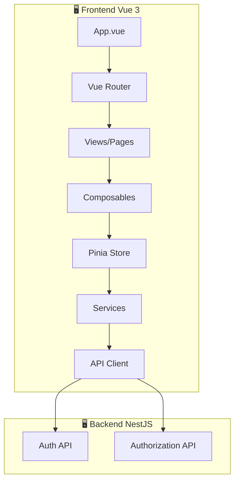
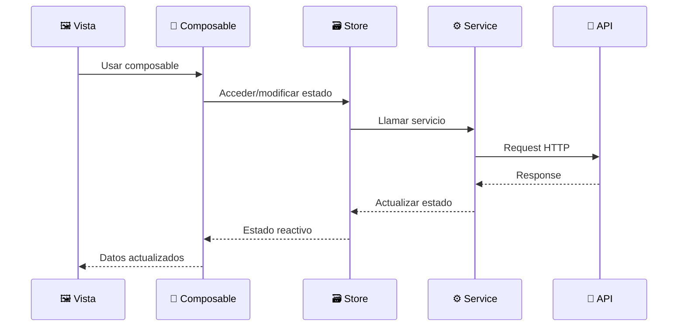
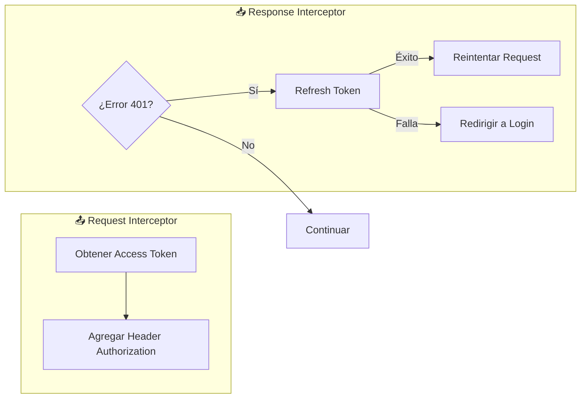
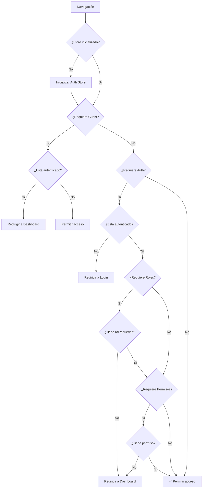
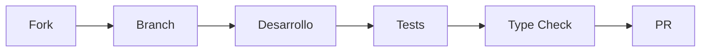

# 🏗️ Arquitectura del Frontend - Documentación Técnica

Esta documentación describe la arquitectura, estructura y patrones utilizados en el frontend de la aplicación. Está diseñada para desarrolladores que deseen contribuir o entender el proyecto.

---

## 📋 Tabla de Contenidos

- [🏗️ Arquitectura del Frontend - Documentación Técnica](#️-arquitectura-del-frontend---documentación-técnica)
  - [📋 Tabla de Contenidos](#-tabla-de-contenidos)
  - [🌐 Visión General](#-visión-general)
  - [📁 Estructura del Proyecto](#-estructura-del-proyecto)
  - [🔧 Stack Tecnológico](#-stack-tecnológico)
  - [🔄 Flujo de Datos](#-flujo-de-datos)
  - [📡 Cliente HTTP (API)](#-cliente-http-api)
    - [Configuración Base](#configuración-base)
    - [Interceptores](#interceptores)
    - [Manejo de Tokens](#manejo-de-tokens)
  - [🗃️ Estado Global (Pinia)](#️-estado-global-pinia)
    - [Auth Store](#auth-store)
  - [🎣 Composables](#-composables)
    - [useAuth](#useauth)
    - [usePermissions](#usepermissions)
  - [🛣️ Sistema de Rutas](#️-sistema-de-rutas)
    - [Configuración de Rutas](#configuración-de-rutas)
    - [Guards de Navegación](#guards-de-navegación)
    - [Meta de Rutas](#meta-de-rutas)
  - [📦 Tipos TypeScript](#-tipos-typescript)
  - [🎨 Guía de Estilos](#-guía-de-estilos)
    - [Convenciones de Código](#convenciones-de-código)
    - [CSS](#css)
  - [🧪 Testing](#-testing)
  - [🚀 Scripts Disponibles](#-scripts-disponibles)
  - [🤝 Guía de Contribución](#-guía-de-contribución)
    - [Antes de Empezar](#antes-de-empezar)
    - [Flujo de Trabajo](#flujo-de-trabajo)
    - [Checklist antes del PR](#checklist-antes-del-pr)

---

## 🌐 Visión General



El frontend está construido siguiendo la **Composition API** de Vue 3 con TypeScript, utilizando patrones modernos como:

- **Composables** para lógica reutilizable
- **Pinia** para gestión de estado
- **Vue Router** con guards de navegación
- **Axios** con interceptores para manejo de tokens

---

## 📁 Estructura del Proyecto

```
frontend/
├── 📁 public/              # Archivos estáticos
├── 📁 src/
│   ├── 📁 composables/     # Hooks reutilizables (useAuth, usePermissions)
│   ├── 📁 lib/             # Utilidades y configuraciones (API client)
│   ├── 📁 router/          # Configuración de rutas y guards
│   ├── 📁 services/        # Servicios para comunicación con API
│   ├── 📁 stores/          # Stores de Pinia (estado global)
│   ├── 📁 types/           # Tipos e interfaces TypeScript
│   ├── 📁 views/           # Componentes de página
│   │   ├── 📁 admin/       # Vistas de administración
│   │   └── 📁 auth/        # Vistas de autenticación
│   ├── 📄 App.vue          # Componente raíz
│   └── 📄 main.ts          # Punto de entrada
├── 📄 .env                 # Variables de entorno (local)
├── 📄 .env.example         # Plantilla de variables
├── 📄 package.json
├── 📄 tsconfig.json
└── 📄 vite.config.ts
```

---

## 🔧 Stack Tecnológico

| Tecnología | Versión | Propósito |
|------------|---------|-----------|
| Vue.js | 3.x | Framework principal |
| TypeScript | 5.x | Tipado estático |
| Vite | 6.x | Build tool y dev server |
| Pinia | 2.x | Gestión de estado |
| Vue Router | 4.x | Enrutamiento SPA |
| Axios | 1.x | Cliente HTTP |
| @vueuse/core | 12.x | Utilidades de composición |

---

## 🔄 Flujo de Datos



**Principios clave:**

1. **Unidireccional**: Los datos fluyen de arriba hacia abajo
2. **Reactivo**: Los cambios de estado se propagan automáticamente
3. **Separación de responsabilidades**: Cada capa tiene un propósito específico

---

## 📡 Cliente HTTP (API)

### Configuración Base

El cliente HTTP está configurado en `src/lib/api.ts`:

```typescript
import axios from 'axios';

const API_URL = import.meta.env.VITE_API_URL || 'http://localhost:3000';

export const api = axios.create({
  baseURL: API_URL,
  headers: {
    'Content-Type': 'application/json',
  },
});
```

### Interceptores

El cliente incluye dos interceptores principales:



**Request Interceptor:**
- Agrega automáticamente el `Authorization: Bearer <token>` a cada petición

**Response Interceptor:**
- Detecta errores 401 (token expirado)
- Intenta renovar el token automáticamente
- Reintenta la petición original con el nuevo token
- Redirige a login si la renovación falla

### Manejo de Tokens

```typescript
export const tokenStorage = {
  getAccessToken: () => localStorage.getItem('accessToken'),
  getRefreshToken: () => localStorage.getItem('refreshToken'),
  setTokens: (accessToken: string, refreshToken: string) => {
    localStorage.setItem('accessToken', accessToken);
    localStorage.setItem('refreshToken', refreshToken);
  },
  clearTokens: () => {
    localStorage.removeItem('accessToken');
    localStorage.removeItem('refreshToken');
  },
};
```

---

## 🗃️ Estado Global (Pinia)

### Auth Store

El store de autenticación (`src/stores/auth.ts`) maneja todo el estado relacionado con la sesión del usuario.

**Estado:**

| Propiedad | Tipo | Descripción |
|-----------|------|-------------|
| `user` | `User \| null` | Usuario autenticado |
| `isLoading` | `boolean` | Indicador de carga |
| `error` | `string \| null` | Mensaje de error |
| `isInitialized` | `boolean` | Si el store fue inicializado |

**Getters (computados):**

| Getter | Retorno | Descripción |
|--------|---------|-------------|
| `isAuthenticated` | `boolean` | Si hay sesión activa |
| `isEmailVerified` | `boolean` | Si el email está verificado |
| `userRoles` | `string[]` | Lista de roles del usuario |
| `userPermissions` | `string[]` | Lista de permisos del usuario |

**Acciones:**

| Acción | Parámetros | Descripción |
|--------|------------|-------------|
| `register` | `RegisterDto` | Registrar nuevo usuario |
| `login` | `LoginDto` | Iniciar sesión |
| `logout` | - | Cerrar sesión |
| `fetchProfile` | - | Obtener perfil actual |
| `initialize` | - | Inicializar store |

**Helpers de roles/permisos:**

```typescript
// Verificar rol único
hasRole('ADMIN')  // true/false

// Verificar cualquier rol de la lista
hasAnyRole(['ADMIN', 'MODERATOR'])

// Verificar todos los roles
hasAllRoles(['USER', 'MODERATOR'])

// Verificar permiso
hasPermission('users:read')

// Verificar cualquier permiso
hasAnyPermission(['users:read', 'users:update'])

// Verificar todos los permisos
hasAllPermissions(['users:read', 'users:update'])
```

---

## 🎣 Composables

Los composables encapsulan lógica reutilizable siguiendo el patrón de composición de Vue 3.

### useAuth

**Archivo:** `src/composables/useAuth.ts`

**Propósito:** Proporcionar acceso reactivo al estado de autenticación y métodos de auth.

```typescript
import { useAuth } from '@/composables';

const {
  // Estado reactivo
  user,
  isLoading,
  error,
  isAuthenticated,
  isEmailVerified,
  isInitialized,
  
  // Métodos
  login,
  register,
  logout,
  initialize,
  clearError,
} = useAuth();
```

**Uso en componente:**

```vue
<script setup lang="ts">
import { useAuth } from '@/composables';

const { user, isAuthenticated, logout } = useAuth();

const handleLogout = async () => {
  await logout();
};
</script>

<template>
  <div v-if="isAuthenticated">
    Hola, {{ user?.firstName }}
    <button @click="handleLogout">Salir</button>
  </div>
</template>
```

### usePermissions

**Archivo:** `src/composables/usePermissions.ts`

**Propósito:** Verificar roles y permisos del usuario actual.

```typescript
import { usePermissions } from '@/composables';

const {
  // Estado reactivo
  roles,
  permissions,
  isAdmin,
  isModerator,
  
  // Métodos
  hasRole,
  hasAnyRole,
  hasAllRoles,
  hasPermission,
  hasAnyPermission,
  hasAllPermissions,
} = usePermissions();
```

**Uso para control de acceso:**

```vue
<script setup lang="ts">
import { usePermissions } from '@/composables';

const { isAdmin, hasPermission } = usePermissions();
</script>

<template>
  <button v-if="isAdmin">
    Panel de Admin
  </button>
  
  <button v-if="hasPermission('users:delete')">
    Eliminar Usuario
  </button>
</template>
```

---

## 🛣️ Sistema de Rutas

### Configuración de Rutas

Las rutas están definidas en `src/router/index.ts`:

```mermaid
graph TD
    subgraph "🌍 Rutas Públicas"
        Home[/ - Home]
    end
    
    subgraph "👤 Solo Invitados"
        Login[/login]
        Register[/register]
        Forgot[/forgot-password]
        Reset[/reset-password]
        Verify[/verify-email]
    end
    
    subgraph "🔒 Requiere Auth"
        Dashboard[/dashboard]
        Profile[/profile]
        ChangePass[/change-password]
    end
    
    subgraph "👑 Solo Admin"
        Admin[/admin]
    end
```

### Guards de Navegación

El router implementa un guard global que verifica:



### Meta de Rutas

Cada ruta puede definir metadatos para control de acceso:

```typescript
interface RouteMeta {
  requiresAuth?: boolean;    // Requiere autenticación
  requiresGuest?: boolean;   // Solo para no autenticados
  roles?: RoleType[];        // Roles permitidos (cualquiera)
  permissions?: string[];     // Permisos requeridos (cualquiera)
  title?: string;            // Título de la página
}
```

**Ejemplo de definición de ruta:**

```typescript
{
  path: '/admin',
  name: 'admin',
  component: () => import('@/views/admin/AdminView.vue'),
  meta: {
    requiresAuth: true,
    roles: ['ADMIN'],
    title: 'Administración'
  },
}
```

---

## 📦 Tipos TypeScript

Todos los tipos están centralizados en `src/types/index.ts`:

**Entidades:**

```typescript
// Usuario
interface User {
  id: string;
  email: string;
  firstName: string;
  lastName: string;
  isActive: boolean;
  isEmailVerified: boolean;
  createdAt: string;
  updatedAt: string;
  roles: Role[];
}

// Rol
interface Role {
  id: string;
  name: RoleType;  // 'ADMIN' | 'MODERATOR' | 'USER'
  description: string;
  permissions: Permission[];
  createdAt: string;
  updatedAt: string;
}

// Permiso
interface Permission {
  id: string;
  name: string;
  description: string;
  module: string;
  createdAt: string;
}
```

**DTOs (Data Transfer Objects):**

| DTO | Campos | Uso |
|-----|--------|-----|
| `RegisterDto` | email, password, firstName, lastName | Registro |
| `LoginDto` | email, password | Login |
| `ForgotPasswordDto` | email | Recuperar contraseña |
| `ResetPasswordDto` | token, newPassword | Restablecer contraseña |
| `ChangePasswordDto` | currentPassword, newPassword | Cambiar contraseña |
| `VerifyEmailDto` | token | Verificar email |
| `ResendVerificationDto` | email | Reenviar verificación |

---

## 🎨 Guía de Estilos

### Convenciones de Código

**Nombrado de archivos:**

| Tipo | Formato | Ejemplo |
|------|---------|---------|
| Componentes/Views | PascalCase | `LoginView.vue` |
| Composables | camelCase con "use" | `useAuth.ts` |
| Services | camelCase con ".service" | `auth.service.ts` |
| Stores | camelCase | `auth.ts` |
| Types | camelCase | `index.ts` |

**Estructura de componentes Vue:**

```vue
<script setup lang="ts">
// 1. Imports
import { ref, computed } from 'vue';
import { useAuth } from '@/composables';

// 2. Props & Emits
const props = defineProps<{...}>();
const emit = defineEmits<{...}>();

// 3. Composables
const { user } = useAuth();

// 4. Estado reactivo
const loading = ref(false);

// 5. Computados
const fullName = computed(() => ...);

// 6. Métodos
const handleSubmit = async () => {...};

// 7. Lifecycle hooks
onMounted(() => {...});
</script>

<template>
  <!-- Template -->
</template>

<style scoped>
/* Estilos con scope */
</style>
```

### CSS

- Usar **CSS con scope** (`<style scoped>`)
- Variables CSS para colores y espaciados consistentes
- Mobile-first cuando sea aplicable
- Clases semánticas y descriptivas

---

## 🧪 Testing

**Configuración:** Vitest + Vue Test Utils

**Ejecutar tests:**

```bash
# Tests unitarios
npm run test:unit

# Con cobertura
npm run test:coverage
```

**Estructura de tests:**

```
src/
├── __tests__/
│   └── App.spec.ts
├── composables/
│   └── __tests__/
│       └── useAuth.spec.ts
└── stores/
    └── __tests__/
        └── auth.spec.ts
```

---

## 🚀 Scripts Disponibles

| Comando | Descripción |
|---------|-------------|
| `npm run dev` | Servidor de desarrollo (Vite) |
| `npm run build` | Build de producción |
| `npm run preview` | Preview del build |
| `npm run type-check` | Verificar tipos TypeScript |
| `npm run lint` | Ejecutar ESLint |
| `npm run format` | Formatear con Prettier |
| `npm run test:unit` | Ejecutar tests unitarios |

---

## 🤝 Guía de Contribución

### Antes de Empezar

1. **Clonar el repositorio**
2. **Instalar dependencias:** `npm install`
3. **Configurar variables:** Copiar `.env.example` a `.env`
4. **Verificar backend:** Asegurar que el backend esté corriendo

### Flujo de Trabajo



1. **Crear branch:** `git checkout -b feature/mi-feature`
2. **Desarrollar** siguiendo las convenciones
3. **Verificar tipos:** `npm run type-check`
4. **Ejecutar tests:** `npm run test:unit`
5. **Crear Pull Request**

### Checklist antes del PR

- [ ] Código sigue las convenciones de estilo
- [ ] Tests pasan correctamente
- [ ] No hay errores de TypeScript
- [ ] Documentación actualizada si aplica
- [ ] Commits descriptivos

---

> 📝 **Última actualización:** Marzo 2026
> 
> 📖 **Backend API:** [http://localhost:3000/api/docs](http://localhost:3000/api/docs)
