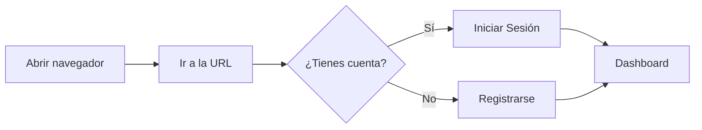
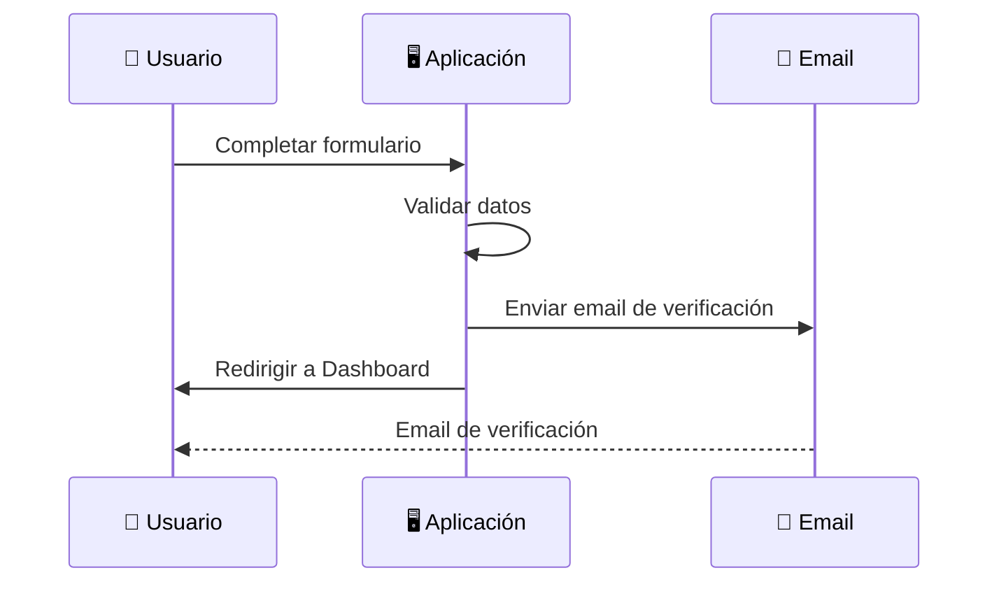
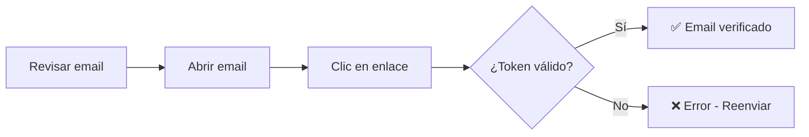
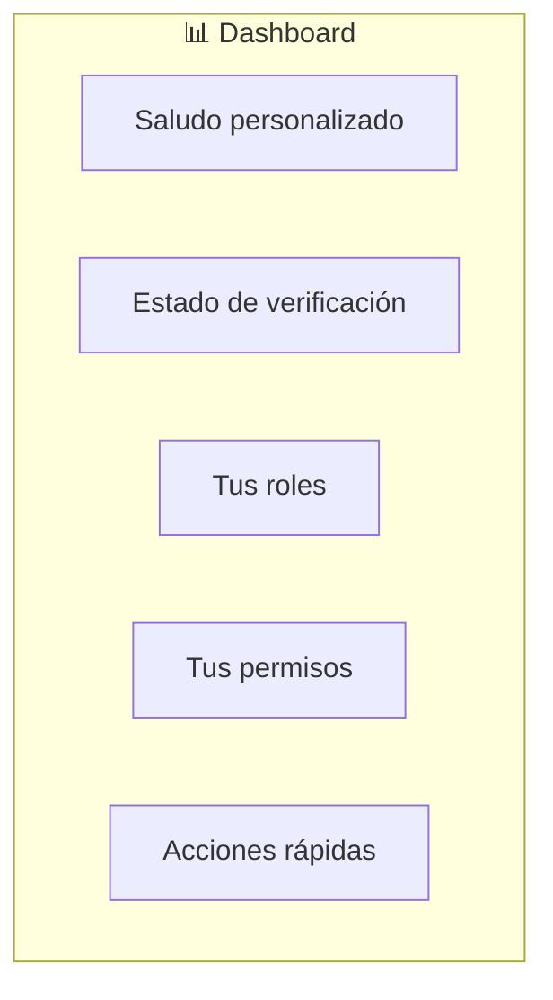
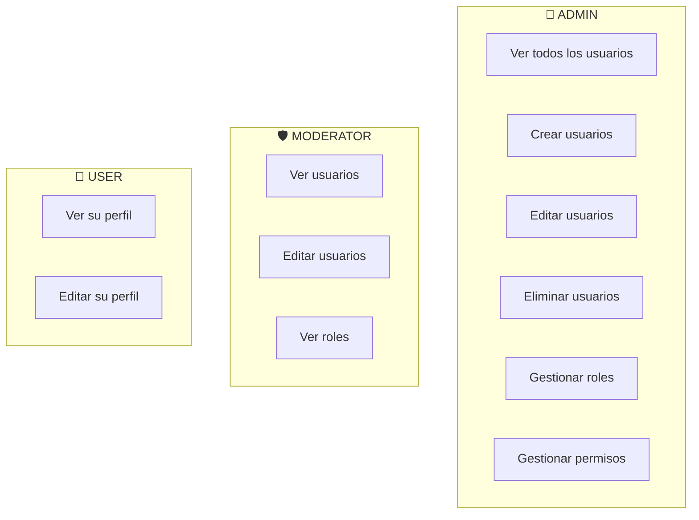

# 📖 Manual de Usuario - Aplicación Frontend

Este manual está diseñado para usuarios finales que deseen utilizar la aplicación web. Aquí encontrarás instrucciones paso a paso para todas las funcionalidades disponibles.

---

## 📋 Tabla de Contenidos

- [📖 Manual de Usuario - Aplicación Frontend](#-manual-de-usuario---aplicación-frontend)
  - [📋 Tabla de Contenidos](#-tabla-de-contenidos)
  - [🚀 Inicio Rápido](#-inicio-rápido)
  - [🔐 Autenticación](#-autenticación)
    - [Crear una Cuenta](#crear-una-cuenta)
    - [Iniciar Sesión](#iniciar-sesión)
    - [Cerrar Sesión](#cerrar-sesión)
  - [📧 Gestión de Email](#-gestión-de-email)
    - [Verificar tu Email](#verificar-tu-email)
    - [Reenviar Verificación](#reenviar-verificación)
  - [🔑 Gestión de Contraseña](#-gestión-de-contraseña)
    - [Recuperar Contraseña Olvidada](#recuperar-contraseña-olvidada)
    - [Restablecer Contraseña](#restablecer-contraseña)
    - [Cambiar Contraseña](#cambiar-contraseña)
  - [👤 Perfil de Usuario](#-perfil-de-usuario)
    - [Ver tu Perfil](#ver-tu-perfil)
    - [Información Mostrada](#información-mostrada)
  - [📊 Dashboard](#-dashboard)
    - [Panel Principal](#panel-principal)
    - [Acciones Rápidas](#acciones-rápidas)
  - [🛡️ Panel de Administración](#️-panel-de-administración)
    - [Acceso al Panel](#acceso-al-panel)
    - [Funcionalidades Disponibles](#funcionalidades-disponibles)
  - [🎭 Roles y Permisos](#-roles-y-permisos)
    - [Tipos de Roles](#tipos-de-roles)
    - [¿Qué puede hacer cada rol?](#qué-puede-hacer-cada-rol)
  - [🔧 Solución de Problemas](#-solución-de-problemas)
  - [❓ Preguntas Frecuentes](#-preguntas-frecuentes)

---

## 🚀 Inicio Rápido

### Acceder a la Aplicación

1. Abre tu navegador web preferido (Chrome, Firefox, Edge, Safari)
2. Ingresa a la URL de la aplicación
3. Verás la página de inicio con las opciones de **Iniciar Sesión** o **Registrarse**



---

## 🔐 Autenticación

### Crear una Cuenta

Para usar la aplicación, primero necesitas crear una cuenta:

**Paso 1:** Haz clic en el botón **"Registrarse"** en la página de inicio o en la barra de navegación.

**Paso 2:** Completa el formulario con tus datos:

| Campo | Requisitos |
|-------|------------|
| 📛 Nombre | Tu nombre de pila |
| 📛 Apellido | Tu apellido |
| 📧 Email | Email válido (ej: usuario@ejemplo.com) |
| 🔑 Contraseña | Ver requisitos abajo |
| 🔑 Confirmar Contraseña | Debe coincidir con la contraseña |

**Requisitos de contraseña:**

- ✅ Mínimo 8 caracteres
- ✅ Al menos una letra mayúscula (A-Z)
- ✅ Al menos una letra minúscula (a-z)
- ✅ Al menos un número (0-9)
- ✅ Al menos un carácter especial (@$!%*?&)

> 💡 **Ejemplo de contraseña válida:** `MiClave123!`

**Paso 3:** Haz clic en **"Crear Cuenta"**

**Paso 4:** ¡Listo! Serás redirigido al Dashboard. También recibirás un email de verificación.



---

### Iniciar Sesión

Si ya tienes una cuenta:

**Paso 1:** Haz clic en **"Iniciar Sesión"**

**Paso 2:** Ingresa tus credenciales:

- 📧 Email con el que te registraste
- 🔑 Tu contraseña

**Paso 3:** Haz clic en **"Iniciar Sesión"**

> ⚠️ **¿Olvidaste tu contraseña?** Haz clic en "¿Olvidaste tu contraseña?" debajo del formulario.

---

### Cerrar Sesión

Para cerrar tu sesión de forma segura:

**Opción 1:** Haz clic en el botón **"Salir"** en la barra de navegación superior.

**Opción 2:** En el Dashboard, haz clic en **"Cerrar Sesión"**.

> 🔒 **Importante:** Siempre cierra sesión si usas un computador compartido o público.

---

## 📧 Gestión de Email

### Verificar tu Email

Cuando te registras, recibirás un email de verificación:

**Paso 1:** Revisa tu bandeja de entrada (y la carpeta de spam)

**Paso 2:** Abre el email titulado "Verifica tu cuenta"

**Paso 3:** Haz clic en el enlace de verificación

**Paso 4:** Verás un mensaje de confirmación



### Reenviar Verificación

Si no recibiste el email o el enlace expiró:

**Paso 1:** En la página de verificación, haz clic en **"Reenviar correo de verificación"**

**Paso 2:** Ingresa tu email cuando se te solicite

**Paso 3:** Revisa tu bandeja de entrada nuevamente

> 💡 **Tip:** Los enlaces de verificación expiran después de cierto tiempo por seguridad.

---

## 🔑 Gestión de Contraseña

### Recuperar Contraseña Olvidada

Si no recuerdas tu contraseña:

**Paso 1:** En la página de login, haz clic en **"¿Olvidaste tu contraseña?"**

**Paso 2:** Ingresa el email de tu cuenta

**Paso 3:** Haz clic en **"Enviar Enlace"**

**Paso 4:** Revisa tu email y haz clic en el enlace de recuperación

> 🔒 **Seguridad:** Por protección, siempre mostramos el mismo mensaje sin importar si el email existe o no.

---

### Restablecer Contraseña

Después de hacer clic en el enlace del email:

**Paso 1:** Serás llevado a la página de restablecimiento

**Paso 2:** Ingresa tu nueva contraseña (siguiendo los requisitos)

**Paso 3:** Confirma la nueva contraseña

**Paso 4:** Haz clic en **"Restablecer Contraseña"**

**Paso 5:** Serás redirigido a la página de login

> ⚠️ **Nota:** Todas tus sesiones activas en otros dispositivos se cerrarán automáticamente.

---

### Cambiar Contraseña

Para cambiar tu contraseña actual (si la recuerdas):

**Paso 1:** Inicia sesión en tu cuenta

**Paso 2:** Ve a tu perfil haciendo clic en tu nombre en la navegación

**Paso 3:** Haz clic en **"Cambiar Contraseña"**

**Paso 4:** Completa el formulario:

| Campo | Descripción |
|-------|-------------|
| Contraseña Actual | Tu contraseña vigente |
| Nueva Contraseña | La nueva contraseña que deseas |
| Confirmar Nueva Contraseña | Repetir la nueva contraseña |

**Paso 5:** Haz clic en **"Cambiar Contraseña"**

---

## 👤 Perfil de Usuario

### Ver tu Perfil

Para acceder a tu perfil:

**Opción 1:** Haz clic en tu nombre en la barra de navegación

**Opción 2:** En el Dashboard, haz clic en **"Ver Perfil"** en Acciones Rápidas

### Información Mostrada

Tu perfil muestra:

| Sección | Información |
|---------|-------------|
| 🖼️ Avatar | Inicial de tu nombre |
| 📛 Nombre Completo | Tu nombre y apellido |
| 📧 Email | Tu correo electrónico |
| ✅ Estado de Verificación | Si tu email está verificado |
| 🎭 Roles | Tus roles asignados (ej: USER, ADMIN) |
| 🔑 Permisos | Los permisos que tienes |

```
┌─────────────────────────────────────┐
│  ┌───┐                              │
│  │ J │  Juan Pérez                  │
│  └───┘  juan@ejemplo.com            │
│         ✓ Verificado                │
├─────────────────────────────────────┤
│  Roles:      [USER]                 │
│  Permisos:   [users:read]           │
├─────────────────────────────────────┤
│  [Cambiar Contraseña] [Dashboard]   │
└─────────────────────────────────────┘
```

---

## 📊 Dashboard

### Panel Principal

El Dashboard es tu página principal después de iniciar sesión:



**Secciones del Dashboard:**

1. **Saludo:** Te da la bienvenida con tu nombre
2. **Estado de Email:** Te indica si tu email está verificado
3. **Roles:** Muestra tus roles asignados
4. **Permisos:** Lista los permisos que tienes
5. **Acciones Rápidas:** Accesos directos a funciones comunes

### Acciones Rápidas

| Acción | Descripción | Disponible para |
|--------|-------------|-----------------|
| 👤 Ver Perfil | Ir a tu página de perfil | Todos |
| 🔑 Cambiar Contraseña | Actualizar tu contraseña | Todos |
| ⚙️ Administración | Ir al panel de admin | Solo ADMIN |
| 🛡️ Moderación | Funciones de moderación | ADMIN, MODERATOR |

---

## 🛡️ Panel de Administración

### Acceso al Panel

El panel de administración solo está disponible para usuarios con rol **ADMIN**.

**Cómo acceder:**

1. Inicia sesión con una cuenta de administrador
2. En el Dashboard, haz clic en **"Administración"** en Acciones Rápidas
3. O navega directamente a `/admin`

> ⛔ Si intentas acceder sin ser admin, serás redirigido al Dashboard.

### Funcionalidades Disponibles

| Sección | Descripción | Estado |
|---------|-------------|--------|
| 👥 Gestión de Usuarios | Ver, editar y gestionar usuarios | 🚧 En desarrollo |
| 🎭 Gestión de Roles | Administrar roles del sistema | 🚧 En desarrollo |
| 📋 Logs del Sistema | Ver actividad del sistema | 🚧 En desarrollo |

> 🚧 **Nota:** Algunas funcionalidades están siendo desarrolladas y se habilitarán próximamente.

---

## 🎭 Roles y Permisos

### Tipos de Roles

El sistema tiene tres roles predefinidos:

| Rol | Icono | Descripción |
|-----|-------|-------------|
| **ADMIN** | 👑 | Administrador con acceso total al sistema |
| **MODERATOR** | 🛡️ | Moderador con permisos de gestión limitados |
| **USER** | 👤 | Usuario estándar con permisos básicos |

### ¿Qué puede hacer cada rol?



| Acción | ADMIN | MODERATOR | USER |
|--------|:-----:|:---------:|:----:|
| Ver su perfil | ✅ | ✅ | ✅ |
| Editar su perfil | ✅ | ✅ | ✅ |
| Ver otros usuarios | ✅ | ✅ | ❌ |
| Editar otros usuarios | ✅ | ✅ | ❌ |
| Eliminar usuarios | ✅ | ❌ | ❌ |
| Gestionar roles | ✅ | ❌ | ❌ |
| Panel de admin | ✅ | ❌ | ❌ |

---

## 🔧 Solución de Problemas

### Problemas Comunes

| Problema | Causa Posible | Solución |
|----------|---------------|----------|
| No puedo iniciar sesión | Credenciales incorrectas | Verifica email y contraseña |
| Contraseña rechazada | No cumple requisitos | Usa mayúsculas, números y símbolos |
| No recibí email | Fue a spam | Revisa carpeta de spam |
| Enlace expirado | Pasó mucho tiempo | Solicita nuevo enlace |
| Acceso denegado | Sin permisos | Contacta al administrador |
| Sesión cerrada | Token expirado | Inicia sesión nuevamente |

### ¿Qué hacer si...?

**...me sale "Acceso denegado":**
- Verifica que tu cuenta esté activa
- Confirma que tienes el rol necesario
- Contacta al administrador del sistema

**...no carga la página:**
- Recarga la página (F5 o Ctrl+R)
- Limpia la caché del navegador
- Verifica tu conexión a internet

**...mi sesión se cerró inesperadamente:**
- Las sesiones expiran por seguridad
- Simplemente vuelve a iniciar sesión
- Si persiste, cambia tu contraseña

---

## ❓ Preguntas Frecuentes

### Cuenta y Registro

**¿Puedo cambiar mi email?**
> Actualmente no es posible cambiar el email asociado a tu cuenta. Deberás crear una nueva cuenta si necesitas usar otro email.

**¿Qué pasa si olvido mi contraseña?**
> Usa la opción "¿Olvidaste tu contraseña?" en la página de login para recibir un enlace de recuperación.

**¿Por qué necesito verificar mi email?**
> La verificación de email confirma que eres el propietario del correo y te permite acceder a todas las funcionalidades.

### Seguridad

**¿Mis datos están seguros?**
> Sí, utilizamos encriptación de contraseñas, tokens JWT y las mejores prácticas de seguridad.

**¿Qué es un "refresh token"?**
> Es un mecanismo que mantiene tu sesión activa de forma segura sin necesidad de ingresar tus credenciales constantemente.

**¿Por qué se cerró mi sesión?**
> Las sesiones se cierran automáticamente después de cierto tiempo de inactividad por seguridad.

### Roles y Permisos

**¿Cómo obtengo más permisos?**
> Los permisos son asignados por el administrador del sistema. Contacta al admin si necesitas acceso adicional.

**¿Puedo tener múltiples roles?**
> Sí, un usuario puede tener varios roles asignados simultáneamente.

---

> 📝 **¿Necesitas más ayuda?** Contacta al administrador del sistema.
> 
> 📅 **Última actualización:** Marzo 2026
